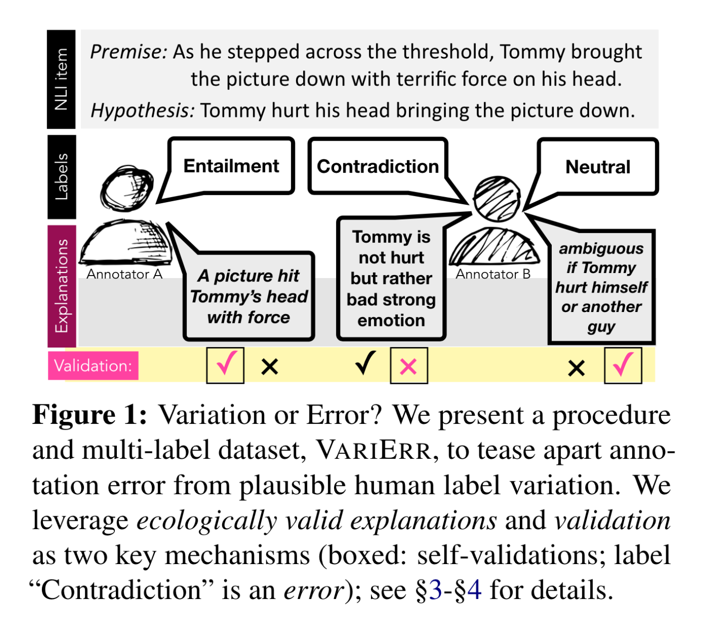

# VariErr NLI: Separating Annotation Error from Human Label Variation #

This repo contains the data and code introduced in the following ACL 2024 paper: 

[VariErr NLI: Separating Annotation Error from Human Label Variation
](https://arxiv.org/abs/2403.01931) 

## Contributions ##

- This repo introduces a systematic methodology and a new dataset, VariErr (variation versus error), focusing on the NLI task in English. 
- VariErr includes a 2-round annotation procedure with annotators explaining each label and subsequently judging the validity of label-explanation pairs. 
- VariErr contains 7,732 validity judgments on 1,933 explanations for 500 re-annotated MNLI items from ChaosNLI. 
- We include in this repo codes to assess the effectiveness of various automatic error detection (AED) methods and GPTs in uncovering errors versus human label variation. 

## VariErr Procedure ##
<p align="center">

</p>

## VariErr Examples ##
<p align="center">

</p>


## Data ##

- We release our 2-round NLI annotations in [*varierr.json*](varierr.json).
- Dataset is also available at *https://huggingface.co/datasets/mainlp/varierr*.

## Code ##
### Please follow these steps to reproduce results in the paper:
- Pip install required packages.
``` 
pip install -r requirements.txt
```
- Run the [*run_experiments.sh*](run_experiments.sh) bash script to train sequence classification and predict supervised/scorers/llms/baselines results. 
``` 
bash run_experiments.sh
```
- Main result [*results/results.tsv*](results/results.tsv) and additional ones are in [*results/*](results/).
- Predictions are saved in [*predictions/*](predictions/).


## Reference ##
### Please cite the following paper: 

```
@inproceedings{weber-2024-varierr,
      title={{VariErr NLI: Separating Annotation Error from Human Label Variation}}, 
      author={Leon Weber-Genzel and Siyao Peng and Marie-Catherine de Marneffe and Barbara Plank},
      year={2024},
      booktitle={ACL 2024},
}
```
## Acknowledgement
- This work is funded by ERC Consolidator Grant DIALECT 101043235 and supported by project KLIMA-MEMES funded by the Bavarian Research Institute for Digital Transformation (bidt), an institute of the Bavarian Academy of Sciences and Humanities. 
- The authors are responsible for the content of this publication.
